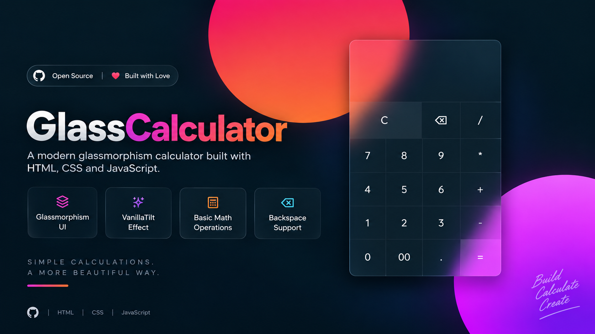

# GlassCalculator

**GlassCalculator** es una calculadora web desarrollada con **HTML, CSS y JavaScript**, con una interfaz moderna basada en el estilo **Glassmorphism**.

El proyecto incorpora efectos visuales de transparencia, desenfoque y movimiento 3D utilizando la librería **VanillaTilt.js**.

<p align="center">
  <a href="https://edgodinez.github.io/GlassCalculator/" target="_blank">
    
  </a>

  <a href="https://github.com/EdGodinez/GlassCalculator" target="_blank">
    
  </a>
</p>

## Vista previa

<p align="center">
  
</p>

## Demo en vivo

Puedes probar la calculadora directamente desde tu navegador sin instalar nada.

**Live Demo:**
[Probar GlassCalculator](https://edgodinez.github.io/GlassCalculator/)

## Vista general

La calculadora permite realizar operaciones matemáticas básicas mediante una interfaz sencilla e interactiva.

Incluye las siguientes operaciones:

* Suma `+`
* Resta `-`
* Multiplicación `*`
* División `/`
* Números decimales `.`
* Borrado completo `C`
* Borrado carácter por carácter `⌫`
* Evaluación de operaciones `=`

## Tecnologías utilizadas

* HTML5
* CSS3
* JavaScript
* VanillaTilt.js
* Google Fonts

## Características

### Diseño Glassmorphism

La interfaz utiliza transparencias, desenfoque de fondo y bordes suaves para conseguir un efecto de cristal.

```css
backdrop-filter: blur(15px);
background: rgba(255, 255, 255, 0.05);
```

### Efecto 3D

La calculadora utiliza **VanillaTilt.js** para generar un efecto de inclinación dependiendo de la posición del cursor.

```javascript
VanillaTilt.init(document.querySelector(".container"), {
    max: 15,
    speed: 400,
    glare: true,
    scale: 1.1,
    "max-glare": 0.2,
});
```

### Borrado completo

El botón `C` elimina todo el contenido actual de la calculadora.

```javascript
calc.txt.value = ''
```

### Borrado carácter por carácter

El botón `⌫` permite eliminar únicamente el último carácter introducido.

```javascript
calc.txt.value = calc.txt.value.slice(0, -1)
```

### Evaluación de operaciones

El botón `=` evalúa la expresión escrita en la pantalla y muestra el resultado.

```javascript
document.calc.txt.value = eval(calc.txt.value)
```

## Estructura del proyecto

```text
GlassCalculator/
│
├── index.html
├── README.md
├── assets/
│   └── glass-calculator-flyers.png
├── css/
│   └── styles.css
└── js/
    └── vanilla-tilt.js
```

## Instalación

No es necesario instalar dependencias.

Clona el repositorio:

```bash
git clone URL_DE_TU_REPOSITORIO
```

Entra a la carpeta del proyecto:

```bash
cd GlassCalculator
```

Después abre `index.html` directamente en tu navegador.

También puedes utilizar una extensión como **Live Server** en Visual Studio Code.

## Uso

1. Selecciona los números de la operación.
2. Utiliza alguno de los operadores matemáticos.
3. Presiona `=` para obtener el resultado.
4. Utiliza `⌫` para eliminar el último carácter.
5. Utiliza `C` para limpiar completamente la calculadora.

## Objetivo del proyecto

Este proyecto fue desarrollado como práctica de desarrollo frontend para reforzar conocimientos de:

* HTML
* CSS Grid
* JavaScript
* Eventos mediante `onclick`
* Diseño Glassmorphism
* Integración de librerías externas
* Efectos visuales e interacción con el usuario

## Posibles mejoras

* Soporte para teclado.
* Botón de porcentaje `%`.
* Operaciones con paréntesis.
* Historial de operaciones.
* Manejo de errores.
* Sustituir `eval()` por una implementación propia.
* Diseño responsive.
* Modo claro y oscuro.

## Autor

**Eduardo Godínez**

Proyecto desarrollado como práctica de desarrollo web frontend.
